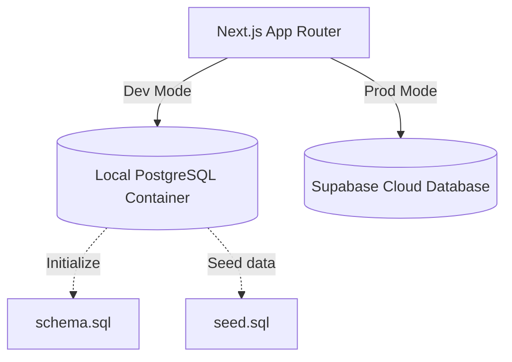

# INTEGRATION PLAN: Gym Management System Code-First Database Architecture

This plan establishes the integration path for implementing a containerized local development environment (Docker/PostgreSQL) and syncing it with the production Supabase cloud database.

---

## 1. Local Environment Architecture (Docker + Postgres)
We will introduce a local Docker container that runs PostgreSQL, mirroring Supabase's database engine.



### Components:
* **`docker-compose.yml`**: Spins up the PostgreSQL database locally on port `5432`.
* **`schema.sql`**: The single source of truth for the database schema (tables, keys, indexes, and defaults).
* **`seed.sql`**: Inserts mock data (sample bookings, memberships, and an admin user) for testing.

---

## 2. Dynamic Connection Integration (`dbClient.ts`)
To achieve local-to-production parity without requiring internet access locally, we will introduce a unified database client:

* **Local Dev (`DB_PROVIDER="postgres"`)**: Connects directly to the local Postgres container using Node's standard `pg` module.
* **Production (`DB_PROVIDER="supabase"`)**: Connects to the Supabase Postgres database via secure REST API fetch operations.

This architecture ensures the frontend UI and routes do not care where the database resides.

---

## 3. Database Schema Blueprint (`schema.sql`)
The schema will be written in standard SQL and stored in the repository root:

```sql
-- schema.sql

-- 1. Bookings Table
CREATE TABLE IF NOT EXISTS bookings (
  id UUID PRIMARY KEY DEFAULT gen_random_uuid(),
  name VARCHAR(255) NOT NULL,
  phone_number VARCHAR(50) NOT NULL,
  session_type VARCHAR(50) NOT NULL, -- 'DAILY', 'WEEKLY', 'MONTHLY'
  cost NUMERIC(10, 2) NOT NULL,
  status VARCHAR(50) DEFAULT 'PENDING' NOT NULL,
  created_at TIMESTAMPTZ DEFAULT CURRENT_TIMESTAMP NOT NULL
);

-- 2. Memberships Table (Linked to bookings)
CREATE TABLE IF NOT EXISTS memberships (
  id UUID PRIMARY KEY DEFAULT gen_random_uuid(),
  booking_id UUID UNIQUE REFERENCES bookings(id) ON DELETE SET NULL,
  name VARCHAR(255) NOT NULL,
  phone_number VARCHAR(50) NOT NULL,
  membership_type VARCHAR(50) NOT NULL,
  active_until TIMESTAMPTZ NOT NULL,
  created_at TIMESTAMPTZ DEFAULT CURRENT_TIMESTAMP NOT NULL
);

-- 3. Users Table (For Local Admin Authentication)
CREATE TABLE IF NOT EXISTS users (
  id UUID PRIMARY KEY DEFAULT gen_random_uuid(),
  email VARCHAR(255) UNIQUE NOT NULL,
  password_hash VARCHAR(255) NOT NULL, -- Stored locally for local parity
  role VARCHAR(50) DEFAULT 'admin' NOT NULL
);
```

---

## 4. Phase-by-Phase Integration Roadmap

### Phase 1: Local Containerization
1. Create `docker-compose.yml` in the project root.
2. Write the database schema to `schema.sql`.
3. Create sample data in `seed.sql` to populate initial bookings and default admin accounts.
4. Provide a shell setup script `scripts/setup-local-db.sh` to start Docker, execute the schema migration, and load seed records.

### Phase 2: Dynamic Database Client
1. Install `pg` (local Postgres driver) and its type declarations `@types/pg` as standard devDependencies.
2. Implement `src/lib/dbClient.ts` to swap between local Postgres commands and Supabase REST operations depending on `DB_PROVIDER` environment settings.
3. Update [src/app/api/bookings/route.ts](file:///home/bamz/Documents/vs_code/gym/src/app/api/bookings/route.ts) to read/write via the new client.

### Phase 3: Secure Local/Production Auth Switch
1. In development, authenticate login credentials against the local `users` table.
2. In production, authenticate against Supabase Auth using the standard login REST endpoint.
3. Update [src/app/admin/page.tsx](file:///home/bamz/Documents/vs_code/gym/src/app/admin/page.tsx) to leverage this swappable authentication flow.

### Phase 4: Production Deployment & Handoff
1. Execute the version-controlled `schema.sql` inside the live Supabase SQL editor to create the cloud tables.
2. Connect production environment variables to point to the Supabase instance.
3. Deliver handoff documentation instructions outlining docker run parameters, schema migrations, and admin configuration processes.
